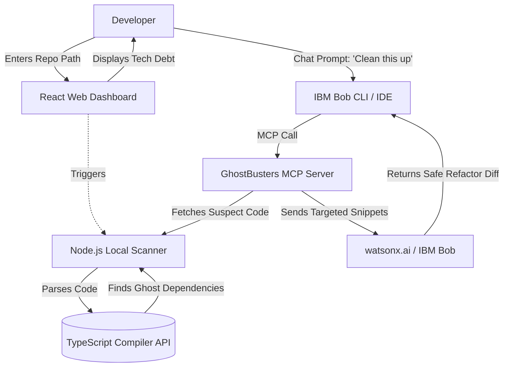

# Architecture

## System Components & Data Flow

## Component Table

| Technology | Responsibility |
|---|---|
| **React / Vite (Frontend)** | Provides a beautiful, minimalistic dashboard for developers to visualize their repository's technical debt. |
| **Node.js (Backend)** | Serves as the core engine. Houses the TypeScript Compiler API logic to statically analyze code without incurring AI token costs. |
| **Model Context Protocol (MCP)** | Acts as the standard interface bridging our local Ghost Scanner with IBM Bob. |
| **IBM Bob (Agent)** | The intelligent execution engine. Reviews the isolated snippets found by the scanner and executes the safe multi-file refactoring. |

## End-to-End Data Flow
1. **Local Parsing:** The Node.js scanner reads the raw `.ts`/`.js` files from the target repository and builds an Abstract Syntax Tree (AST).
2. **Identification:** It isolates code blocks flagged with diagnostic `TS6133` ("declared but never used").
3. **Visualization:** This raw data is sent to the React frontend to be displayed to the user.
4. **Remediation:** Through the MCP Server, IBM Bob receives *only* the flagged code blocks, minimizing token usage, and generates the final deletion diffs.
