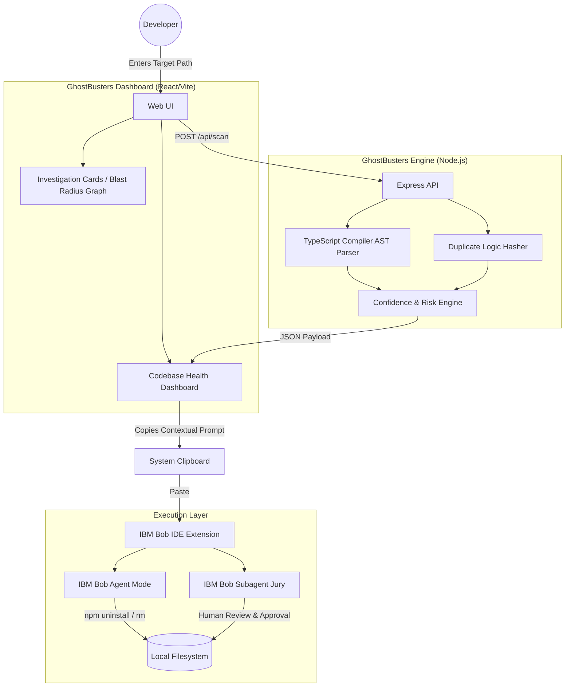

# Architecture

GhostBusters operates on a hybrid architecture, splitting the responsibilities between a lightning-fast local static analysis engine and a cloud-powered AI execution agent (IBM Bob).

## Data Flow Diagram

The following Mermaid diagram illustrates how user input flows from the web dashboard, through our local AST scanning engine, and finally into the IBM Bob Agent for safe code liquidation.

## System Components

1. **GhostBusters Dashboard (Frontend):** A React/Vite application utilizing glassmorphism CSS. It visually renders the technical debt in an accessible format and generates the highly-contextual AI prompts required for IBM Bob.
2. **GhostBusters Engine (Backend):** A Node.js/Express server that acts as the "MRI Machine." It uses the TypeScript Compiler API to physically read and map the Abstract Syntax Tree of the target repository, calculating mathematical Confidence Scores for each piece of debt.
3. **Execution Layer (IBM Bob):** Our system delegates all actual file modifications and package uninstalls to IBM Bob. This ensures that the codebase is protected by Bob's safe rollback and intelligent testing capabilities.
